일단 동작 [영상](https://streamable.com/2xm9g) 먼저!

# 시작하면서

요즘이 어떤 세상인데 우리집 낡은 보일러는 IoT도 안된다. 추운 겨울 날 퇴근하기 전에 스마트폰으로 보일러를 켜두고, 따뜻한 집을 상상하며 퇴근하고 싶던 나의 로망은 [이런 거](http://m.todayhumor.co.kr/view.php?table=bestofbest&no=135305), [이런 거](https://www.slideshare.net/rlaxogns/ss-41386800)를 하게 이르렀고, 따로 정리하진 않았지만 [샤오미 리모트 컨트롤러](https://www.gearbest.com/smart-home/pp_229556.html)와 [RF 릴레이 모듈](https://tr.aliexpress.com/item/DC-12V-2-CH-Relay-Receiver-Wireless-Remote-Control-Switch-Light-IR-Frequency-Learning-Momentary-Toggle/32757165692.html)을 써서 더 쉽고 간단하게 만들기 위해 많은 시도를 했었다.

라즈베리파이는 설정해야 할 것이 많고 무엇보다 와이파이가 불안정했다. 요즘 나오는 버전은 더 좋아졌겠지? 게다가 이것저것 프로그래밍해야 하는데 이게 프로그래머가 아니고서야 쉽게 할 수 있는 게 아니다. 보일러 컨트롤러를 뜯어서 설치하는 것도 썩 맘에 들지 않았다. 내가 원하던 건 보일러 전원 버튼을 눌러주는 단순하고 아름다운 그 무언가다. 그러다 우연히 [마이크로 봇 푸쉬](https://microbot.is/ko/push/)와 [스위치 봇](https://www.switch-bot.com/)을 발견했다. 딱 내가 생각하던 환상적인 모습이었지만 이것들은 블루투스로 동작했고 와이파이와 연결하려면 셋탑박스를 함께 사야했다. 이 모든 걸 구성하려면 역시 너무 비쌌다. 그러던 내게 꿈같은 계시가 있었으니, 그것은 바로 [서보](https://www.youtube.com/watch?v=J8atdmEqZsc)였다! 

서보(servo)는 "주인에 충실하다"라는 이름답게 지시한 각도대로 회전하는 모터다. 모질라에서 [rust](https://www.rust-lang.org/)로 개발하고 있는 차세대 브라우저 엔진의 이름이기도 하다. 아무튼 이놈을 와이파이를 지원하는 마이크로 컨트롤러에 연결해 보일러 스위치 옆에 붙히면 원하던 모습이 나올 것 같았다. 그러고보니 꽤 오래전에 사둔 "[spark](https://www.particle.io/products/hardware/photon-wifi)"가 있었지?

# photon(as is spark)

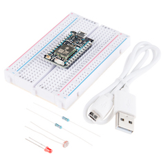

내가 이 녀석을 프리오더로 처음 산건 몇 년 전이다. 라즈베리파이의 귀찮음이 싫던 차에 이 녀석이 나온다는 소식을 듣고 사놓고 지금까지 썩혀둔 것이다. 사두면 언젠가 사용할 일이 있을 거라 생각했었는데 그게 바로 오늘이다. 베란다 한 구석 잡동사니 박스에 담겨 있던 photon을 꺼내 설정을 시작했다.

## Particle CLI 설치
우선 usb로 `photon`을 연결해 CLI를 설치한다. [Homebrew](https://brew.sh/)가 설치되어 있지 않다면 먼저 설치해야 한다. 

``` bash
bash <( curl -sL https://particle.io/install-cli )
```

CLI 설치를 완료하면 CLI를 통해 photon을 설정한다. photon이 접속할 와이파이와 photon 이름 등을 설정 할 수 있다.

``` bash
particle setup
```

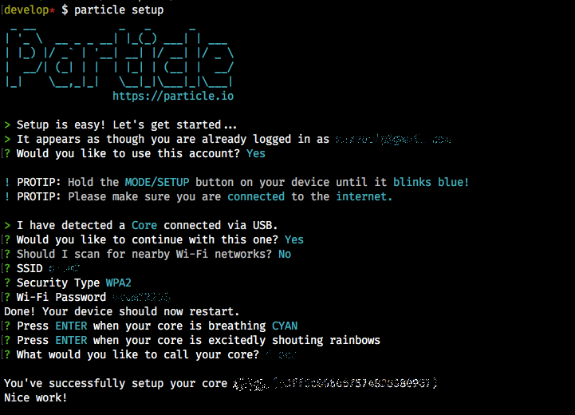

## 개발
`photon`에서 실행 할 프로그램을 쉽게 개발하기 위해 [웹 IDE](https://build.particle.io/)로 접속한다. 

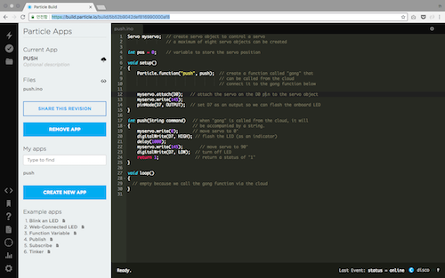

앱 이름은 `push`로 하고 아래 코드를 작성한다.

``` cpp
Servo myservo;  // create servo object to control a servo
                // a maximum of eight servo objects can be created

int pos = 0;    // variable to store the servo position

void setup()
{
    Particle.function("push", push);  // create a function called "push" that
                                      // can be called from the cloud
                                      // connect it to the gong function below

    myservo.attach(D0);   // attach the servo on the D0 pin to the servo object
    myservo.write(145);   // first, move servo to 145° 
    pinMode(D7, OUTPUT);  // set D7 as an output so we can flash the onboard LED
}

int push()                   // when "push" is called from the cloud, it will
{                            // be accompanied by a string.
    myservo.write(0);        // move servo to 0°
    digitalWrite(D7, HIGH);  // flash the LED (as an indicator)
    delay(1000);             
    myservo.write(145);      // move servo to 145°
    digitalWrite(D7, LOW);   // turn off LED
    return 1;                // return a status of "1"
}

void loop()
{
  // empty because we call the push function via the cloud
}
```

코드는 간단하다. `145°`에서 `0°`로 서보 모터를 회전하는 `push` 함수를 만들고 등록했다. 우리는 이 함수를 모바일 애플리케이션을 통해 바로 호출할 것이다.

이제 photon과 서보를 연결한다.

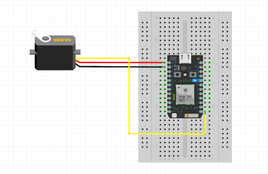
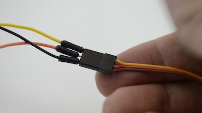

# IFTTT

[IFTTT](https://ifttt.com/)는 `If This Then That`의 약자로 인터넷에 있는 여러 서비스를 상황과 조건에 맞게 조합해 `recipe`라 불리는 명령을 만들수 있다. `photon`에 등록한 `push` 함수를 호출하는 `recipe`를 만들어 보자.

## Button 위젯 활성화

[이곳](https://ifttt.com/services/do_button/settings)에서 `button` 위젯을 활성화 한다. `button` 위젯은 한 번의 탭으로 명령을 실행할 수 있게 해준다.

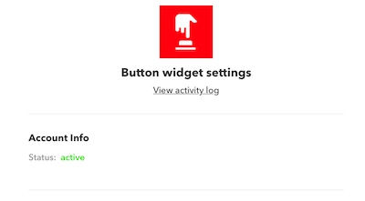

## 애플릿 추가

* 애플릿을 추가하기 위해 [이곳](https://ifttt.com/create)으로 이동한다.
  - 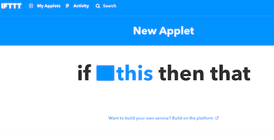
* `this`를 클릭하고 `button` 위젯을 검색해 선택한다.
  - 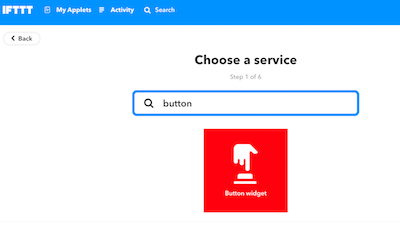
* `button press`를 선택한다.
  - 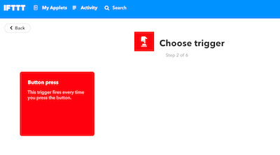
* `that`을 클릭한다.
  - 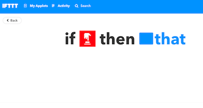
* `particle` 서비스를 검색해 선택한다.
  - 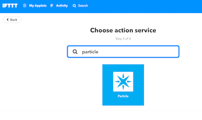
* `Call a function`을 선택한다.
  - 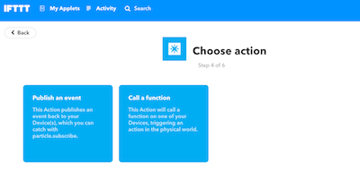
* `Then call`에 `push on ***`을 선택하고, `with input`은 비워둔다.
  - 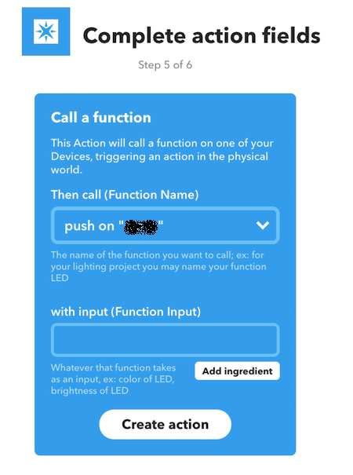

## 앱버튼 추가

* 앱스토어에서 `ITFFF`를 검색해 설치하고 실행한다.
* 추가한 애플릿을 선택해 설정 화면으로 들어간다.
  - 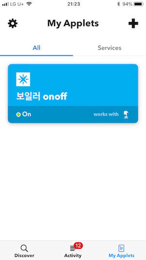
* `Homescreen icon`을 탭한다.
  - 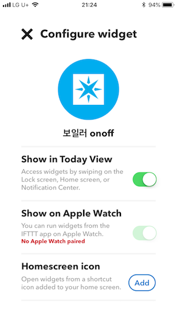
* 화면에서 안내하는 대로 홈스크린 아이콘을 추가한다.
  - 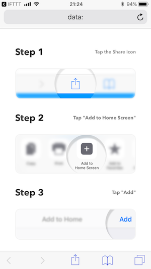
* 홈스크린에 추가한 아이콘을 클릭해 명령을 실행한다.
  - 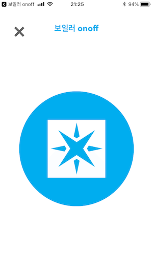

# 동작 영상
실제 동작하는 영상은 [여기](https://streamable.com/2xm9g)에서 확인 할 수 있다.

# 마치며
이번에는 최대한 코딩을 하지 않고 시스템을 구축하지 않아도 사용할 수 있게 많이 고민했다. 이 정도면 누구나 쉽게 사용할 수 있겠지. 게다가 싸다. `photon`이 $19, 서보는 2000원 정도이다. 이 매뉴얼을 참고해 재밌고 유용한 많은 프로젝트들이 만들어지면 좋겠다. 


